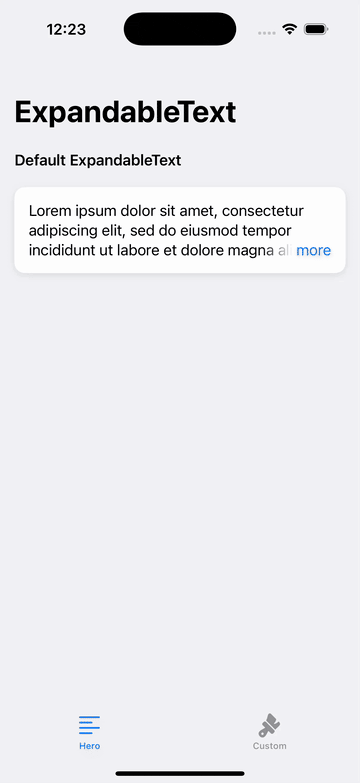
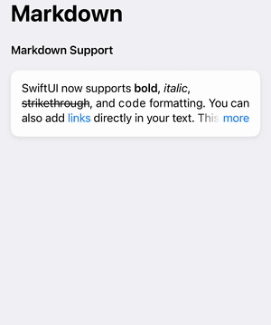
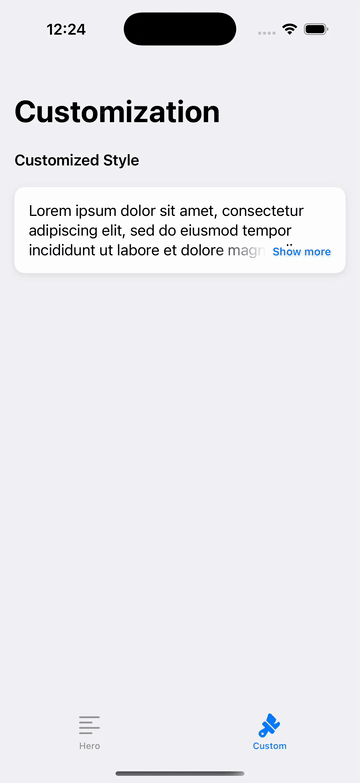

# ExpandableText

[](https://github.com/username/swiftui-expandable-text/actions/workflows/swift.yml)
[](https://swift.org/package-manager/)
[](https://swift.org)
[](LICENSE)
[](https://developer.apple.com/swift)

SwiftUI expandable text with markdown support. Renders bold, italic, strikethrough, code, and links—then truncates gracefully with animated "Show More". Auto-detects truncation, RTL-aware, works on iOS/macOS/tvOS/watchOS.

<p align="center">
  &nbsp;&nbsp;&nbsp;&nbsp;
</p>

## Features

- Markdown rendering support (**bold**, *italic*, ~~strikethrough~~, `code`, [links](url))
- Expand text with customizable animation
- Automatically detects text truncation
- Customizable "more" button text, style, and font
- Supports various text styling options
- Works across iOS, macOS, tvOS, and watchOS
- Smooth gradient truncation effect
- RTL language support

## Requirements

- iOS 15.0+ / macOS 12.0+ / tvOS 15.0+ / watchOS 8.0+
- Swift 6.0+
- Xcode 16.2+

## Installation

### Swift Package Manager

Add the following to your `Package.swift` file:

```swift
dependencies: [
    .package(url: "https://github.com/ivan-magda/swiftui-expandable-text.git", from: "2.0.0")
]
```

Or add it directly through Xcode:
1. Go to **File** > **Add Package Dependencies...**
2. Enter the repository URL: `https://github.com/ivan-magda/swiftui-expandable-text.git`
3. Follow the prompts to complete the installation

## Usage

### Basic Usage

```swift
import SwiftUI
import ExpandableText

struct ContentView: View {
    var body: some View {
        ExpandableText("Lorem ipsum dolor sit amet, consectetur adipiscing elit...")
            .padding()
    }
}
```

### Markdown Support

String literals automatically render markdown:

```swift
ExpandableText("This is **bold**, *italic*, and ~~strikethrough~~ text. Visit [Apple](https://apple.com) for more.")
```

For string variables or to disable markdown parsing, use `verbatim:`:

```swift
let text = fetchedContent // String variable
ExpandableText(verbatim: text)
```

### Customization

```swift
ExpandableText(longText)
    .font(.body)
    .foregroundColor(.primary)
    .lineLimit(3)
    .moreButtonText("Show more")
    .moreButtonFont(.caption.bold())
    .moreButtonForegroundStyle(.blue)
    .expandAnimation(.easeOut)
```

## Available Modifiers

| Modifier | Description | Default |
|----------|-------------|---------|
| `font(_:)` | Sets the font for the text | `.body` |
| `foregroundColor(_:)` | Sets the text color | `.primary` |
| `lineLimit(_:)` | Sets maximum number of lines when collapsed | `3` |
| `moreButtonText(_:)` | Text for the "show more" button | `"more"` |
| `moreButtonFont(_:)` | Font for the "show more" button | Same as text font |
| `moreButtonForegroundStyle(_:)` | Shape style for the "show more" button | `.accentColor` |
| `expandAnimation(_:)` | Animation used when expanding/collapsing | `.default` |

## How It Works

The `ExpandableText` component works by:

1. Measuring both the truncated and full-size text
2. Detecting if truncation is necessary
3. Applying a gradient mask to create a smooth fade effect
4. Adding a "show more" button when text is truncated
5. Expanding/collapsing with animation when the button is tapped

## Advanced Example

```swift
struct BlogPostView: View {
    let post: BlogPost

    var body: some View {
        VStack(alignment: .leading, spacing: 12) {
            Text(post.title)
                .font(.title)
                .bold()

            Text("Posted by \(post.author) • \(post.dateFormatted)")
                .font(.caption)
                .foregroundColor(.secondary)

            ExpandableText(verbatim: post.content)
                .font(.body)
                .foregroundColor(.primary)
                .lineLimit(4)
                .moreButtonText("Read more")
                .moreButtonFont(.caption.bold())
                .moreButtonForegroundStyle(.blue)
                .padding(.vertical, 4)

            Divider()
        }
        .padding()
    }
}
```

## Contributing

Contributions are welcome! Please feel free to submit a Pull Request.

1. Fork the project
2. Create your feature branch (`git checkout -b feature/amazing-feature`)
3. Commit your changes (`git commit -m 'Add some amazing feature'`)
4. Push to the branch (`git push origin feature/amazing-feature`)
5. Open a Pull Request

## License

This project is licensed under the MIT License - see the [LICENSE](LICENSE) file for details.

## Author

Ivan Magda - [@ivanmagda](https://github.com/ivanmagda)

## Acknowledgments

- Inspired by the need for a more customizable text expansion solution in SwiftUI
- Thanks to the SwiftUI community for support and feedback
