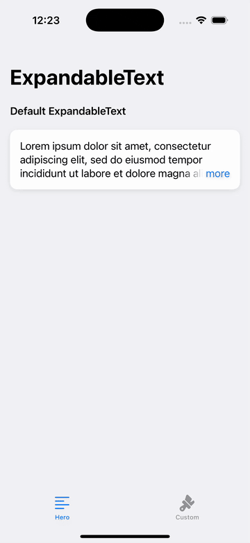
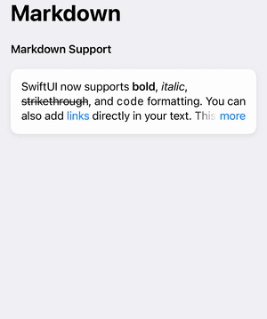
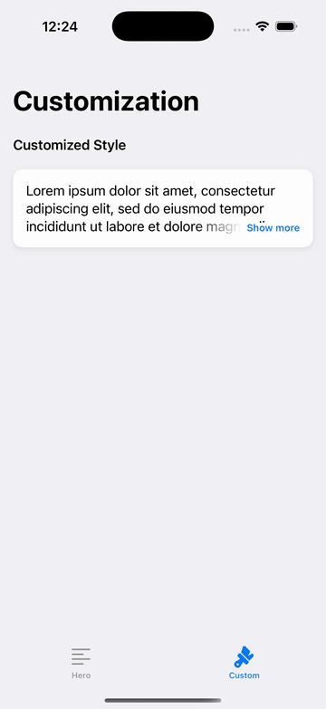

# ExpandableText

SwiftUI text that renders markdown, truncates to a line limit, and expands on tap with an animated "more" button.

[](https://github.com/ivan-magda/swiftui-expandable-text/actions/workflows/swift.yml)
[](https://swift.org/package-manager/)
[](https://swift.org)
[](LICENSE)
[](https://developer.apple.com/swift)

<p align="leading">
  &nbsp;&nbsp;&nbsp;&nbsp;
</p>

## Table of Contents

- [Background](#background)
- [Features](#features)
- [Installation](#installation)
- [Usage](#usage)
- [Available Modifiers](#available-modifiers)
- [How It Works](#how-it-works)
- [Project Structure](#project-structure)
- [Contributing](#contributing)
- [License](#license)

## Background

Long text in a compact layout, such as an article preview, a comment, or a product description, often needs to collapse to a few lines with a way to reveal the rest. `ExpandableText` handles this in a single view: it measures the full text against the truncated version, shows a "more" button only when the content overflows, and reveals the rest with an animation on tap. It renders markdown in string literals and keeps the truncation fade on the correct edge in right-to-left layouts.

## Features

- Renders markdown in string literals: **bold**, *italic*, ~~strikethrough~~, `code`, and [links](url)
- Detects truncation automatically by measuring intrinsic against truncated size
- Shows the "more" button only when the text overflows the line limit
- Animates expansion with a configurable animation
- Fades the truncated edge with a gradient mask that is RTL-aware
- Customizes the button text, font, and foreground style
- Runs on iOS, macOS, tvOS, and watchOS

## Installation

### Xcode

1. Open **File** > **Add Package Dependencies...**
2. Enter the repository URL: `https://github.com/ivan-magda/swiftui-expandable-text.git`
3. Select the version rule and add the `ExpandableText` library to your target.

### Package.swift

Add the package to your `dependencies`:

```swift
dependencies: [
    .package(url: "https://github.com/ivan-magda/swiftui-expandable-text.git", from: "2.1.0")
]
```

Then add the product to your target:

```swift
.target(
    name: "YourTarget",
    dependencies: [
        .product(name: "ExpandableText", package: "swiftui-expandable-text")
    ]
)
```

## Usage

### Basic

```swift
import SwiftUI
import ExpandableText

struct ContentView: View {
    var body: some View {
        ExpandableText("Lorem ipsum dolor sit amet, consectetur adipiscing elit...")
            .padding()
    }
}
```

### Markdown

A string literal is treated as a `LocalizedStringKey`, so markdown is rendered:

```swift
ExpandableText("This is **bold**, *italic*, and ~~strikethrough~~ text. Visit [Apple](https://apple.com) for more.")
```

For a `String` variable, or to display text without markdown parsing, use `verbatim:`. Leading and trailing whitespace is trimmed:

```swift
let content = fetchUserComment()
ExpandableText(verbatim: content)
```

### Customization

```swift
ExpandableText(verbatim: longText)
    .font(.body)
    .foregroundStyle(.primary)
    .lineLimit(3)
    .moreButtonText("Show more")
    .moreButtonFont(.caption.bold())
    .moreButtonForegroundStyle(.blue)
    .expandAnimation(.easeOut)
```

The `moreButtonForegroundStyle` modifier accepts any `ShapeStyle`, so gradients work too:

```swift
ExpandableText(verbatim: longText)
    .moreButtonForegroundStyle(
        .linearGradient(
            colors: [.purple, .pink],
            startPoint: .leading,
            endPoint: .trailing
        )
    )
```

## Available Modifiers

| Modifier | Description | Default |
|----------|-------------|---------|
| `font(_:)` | Font for the text content | `.body` |
| `foregroundStyle(_:)` | Color of the text | `.primary` |
| `lineLimit(_:)` | Maximum lines shown when collapsed | `3` |
| `moreButtonText(_:)` | Text on the expand button | `"more"` |
| `moreButtonFont(_:)` | Font for the button | Inherits `font(_:)` |
| `moreButtonForegroundStyle(_:)` | `ShapeStyle` for the button | `.accentColor` |
| `expandAnimation(_:)` | Animation used when expanding | `.spring` |

> `foregroundColor(_:)` remains available but is deprecated in favor of `foregroundStyle(_:)`.

## How It Works

The view renders the text twice: once visible with the line limit applied, and once hidden and unconstrained. It reads both sizes through a `PreferenceKey` and compares them; when they differ, the text is truncated. That drives the `isTruncated` state, which gates a gradient mask over the trailing edge and the "more" button overlay. Tapping the button toggles the expanded state inside the configured animation. The gradient mask reads the layout direction, so the fade falls on the correct edge in RTL.

## Project Structure

```
Sources/ExpandableText/
├── ExpandableText.swift            # Main view, initializers, truncation state
├── ExpandableText+Modifiers.swift  # Value-semantic customization modifiers
├── TruncationTextMask.swift        # RTL-aware gradient fade mask
└── ViewSizeReader.swift            # PreferenceKey-based size measurement
```

## Contributing

Issues and pull requests are welcome. To build and test locally:

```bash
swift build
swift test
```

SwiftLint runs in CI with `--strict`; the configuration is in `.swiftlint.yml`.

## License

ExpandableText is released under the MIT License. See [LICENSE](LICENSE) for details.
